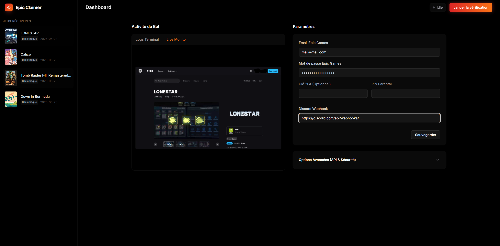
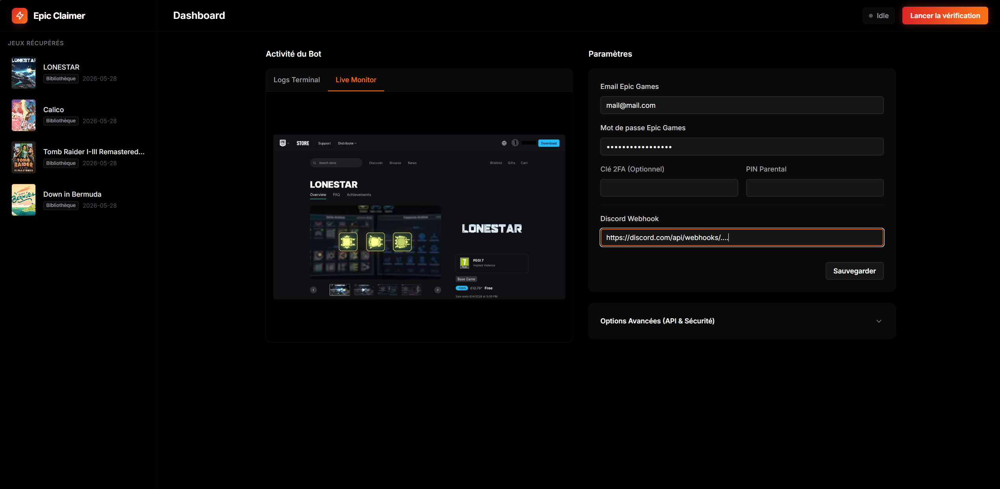

# Epic Games Claimer

Bot automatisé pour récupérer les jeux gratuits Epic Games chaque semaine avec une interface web de gestion.

## Aperçu du Dashboard




## Déploiement rapide (Docker)

Vous pouvez déployer le projet instantanément en utilisant l'image Docker précompilée.
Copiez le fichier `docker-compose.yml` suivant :

```yaml
services:
  epic-claimer:
    image: ghcr.io/hoesaek/epicgames-claimer:latest
    container_name: epic-claimer
    restart: unless-stopped
    security_opt:
      - seccomp:unconfined
    ports:
      - 8080:8080
    volumes:
      - ./config.json:/app/config.json
      - ./epic-games.json:/app/epic-games.json
      - ./browser_data:/app/browser_data
      - ./screenshots:/app/screenshots
    environment:
      - TZ=Europe/Paris
```

1. Créez des fichiers vides `config.json` et `epic-games.json` dans le même dossier.
2. Lancez la commande `docker compose up -d`.
3. Accédez à `http://<VOTRE_IP>:8080` depuis un navigateur.

## Fonctionnalités principales
- Mode Headless complet.
- Dashboard web pour la configuration et la consultation des jeux.
- Affichage en temps réel des actions du bot (Live Monitor).
- Prise en charge de la double authentification (2FA) et du code PIN parental.
- Notifications Discord via Webhook.

Les mots de passe et adresses email sont sauvegardés uniquement en local dans votre fichier `config.json`.
